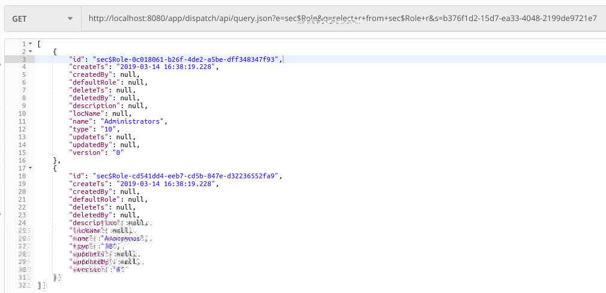

# JPA Web API

[](http://www.apache.org/licenses/LICENSE-2.0)
[](https://travis-ci.org/cuba-platform/jpawebapi)
[](https://github.com/cuba-platform/jpawebapi/wiki)

## Overview

The universal JPA web API enables to load and save any entities defined in the application data model by sending simple HTTP requests.

This provides an easy way to integrate with a wide range of third-party applications – from the JavaScript code executed in the browser to arbitrary systems running on Java, .NET, PHP or any other platform.

Key API features:

- Loading entity instances from the database by identifier or by JPQL query with parameters.
- Saving new and modified instances, deleting instances.
- Obtaining a description of the data model in HTML format.
- Data representation in JSON and XML formats.
- Middleware service calls.
- User authentication.

Read addon [Wiki](https://github.com/cuba-platform/jpawebapi/wiki) for additional information.

## Installation

You can install the add-on by coordinates choosing the required version of the add-on from the table.

In case you want to install the add-on by manual editing or by building from sources see the complete add-ons installation guide in [CUBA Platform documentation](https://doc.cuba-platform.com/manual-latest/manual.html#app_components_usage).

### By Coordinates

1. Open your application in CUBA Studio. Check the latest version of CUBA Studio on the [CUBA Platform site](https://www.cuba-platform.com/download/previous-studio/).
2. Go to *CUBA -> Marketplace* in the main menu.

 

3. Click the icon in the upper-right corner.

 

4. Paste the add-on coordinates in the corresponding field as follows:

 `com.haulmont.addon.jpawebapi:jpawebapi-global:<add-on version>`

 where `<add-on version>` is compatible with the used version of the CUBA platform.

 | Platform Version | Add-on Version |
|------------------|----------------|
| 7.1.X            | 1.0.0          |

5. Click *Install* and apply the changes. The add-on will be installed to your project.

After that the JPA Web API functionality will be available at:

- `{host:port}/app/dispatch/api/*` - for Web module
- `{host:port}/app-portal/api/*` - for Portal module

## Customization

JPA Web API URL can be customized via `jpawebapi.mapping.url` app property both for `web` and `portal` application modules.

## Demo

1. Login as `admin / admin` with `GET` request:

```
http://localhost:8080/app/dispatch/api/login?u=admin&p=admin&l=ru
```

2. Load `Users` list using auth token:

```
http://localhost:8080/app/dispatch/api/query.json?e=sec$Role&q=select+r+from+sec$Role+r&s=b376f1d2-15d7-ea33-4048-2199de9721e7
```


